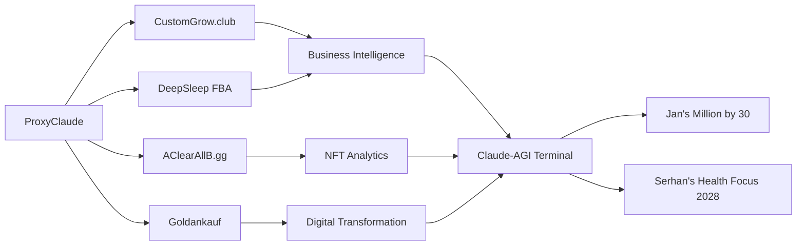

# 🔄 ProxyClaude Synergien mit dem bestehenden Geschäftsportfolio

## Überblick

ProxyClaude wurde strategisch konzipiert, um Synergien mit dem bestehenden Geschäftsportfolio zu schaffen und als zentrale Infrastruktur für verschiedene Projekte zu dienen. Dieses Dokument beschreibt die konkreten Integrationen und den Mehrwert für das Gesamtportfolio.



## 🌟 Strategische Vision

### Business Case für Enterprise Tier
1. **ProxyClaude Unlimited** als Kernprodukt
2. **CrossSelling** zu Custom-Grow.club Analytics
3. **API-First** Ansatz für AClearAllB.gg Integration
4. **Automation** für DeepSleep FBA Workflows

### ROI Kalkulation
- Enterprise Kunde (€100/Monat): 12x basic tier
- Reduced Churn durch besseren Support
- Upsell-Potenzial zu anderen Services

## 🔄 Projektspezifische Integrationen

### 1. CustomGrow.club Integration

**Technische Implementierung**:
```typescript
// proxyclaude/integrations/customgrow.ts
export class CustomGrowIntegration {
  constructor(private config: IntegrationConfig) {}
  
  // Analytics-Integration
  async syncAnalytics() {
    // Zwei-Wege-Sync zwischen ProxyClaude und CustomGrow
    await this.exportProxyClaudeMetricsToCustomGrow();
    await this.importCustomGrowDataToProxyClaude();
    
    // Erstellen von Cross-Platform-Dashboards
    await this.createIntegratedDashboards();
  }
  
  // Benutzer-Management
  async syncUsers() {
    // Single Sign-On zwischen Plattformen
    await this.setupSSOForPlatforms();
    
    // Gemeinsamer Benutzer-Pool
    await this.createSharedUserPool();
  }
  
  // Cross-Selling-Opportunities
  async identifyCrossSellOpportunities() {
    // KI-basierte Analyse des Nutzerverhaltens
    return await claude.analyzeUserBehavior({
      platforms: ['proxyclaude', 'customgrow'],
      lookForPatterns: true,
      identifyOpportunities: true
    });
  }
}
```

**Geschäftlicher Mehrwert**:
- Gemeinsamer Kundenstamm
- Integrierte Analytics für bessere Entscheidungen
- Upsell-Potenzial zwischen Plattformen

### 2. DeepSleep FBA Integration

**Technische Implementierung**:
```typescript
// proxyclaude/integrations/deepsleep.ts
export class DeepSleepFBAIntegration {
  constructor(private config: FBAConfig) {}
  
  // Amazon-Integration
  async setupAmazonFBAIntegration() {
    // API-Verbindung zu Amazon Seller Central
    await this.connectToAmazonAPI();
    
    // Automatisierte Bestellverarbeitung
    await this.setupOrderProcessing();
    
    // Inventory-Management
    await this.setupInventorySync();
  }
  
  // KI-gestützte Produktbeschreibungen
  async generateProductDescriptions(product: Product) {
    return await claude.optimizeProductDescription({
      product,
      marketplace: 'amazon',
      optimizeFor: ['conversion', 'seo', 'compliance']
    });
  }
  
  // Verkaufsanalysen
  async analyzeSalesPerformance() {
    const data = await this.fetchSalesData();
    return claude.analyzeSalesPerformance(data);
  }
}
```

**Geschäftlicher Mehrwert**:
- Automatisierte Produktbeschreibungen
- Optimierte Amazon-Listings
- Datengestützte Verkaufsstrategie

### 3. AClearAllB.gg NFT Integration

**Technische Implementierung**:
```typescript
// proxyclaude/integrations/aclearallb.ts
export class AClearAllBIntegration {
  constructor(private config: NFTConfig) {}
  
  // Solana-Blockchain-Integration
  async connectSolanaChain() {
    // Verbindung zur Solana-Blockchain
    await this.setupBlockchainConnection();
    
    // NFT-Metadaten-Verwaltung
    await this.setupMetadataManagement();
    
    // Wallet-Integration
    await this.setupWalletConnections();
  }
  
  // KI-generierte NFT-Beschreibungen
  async generateNFTDescriptions(nft: NFT) {
    return await claude.generateNFTDescription({
      nft,
      style: 'engaging',
      includeAttributes: true,
      optimizeForMarketplace: true
    });
  }
  
  // Marktanalyse
  async analyzeNFTMarket() {
    const data = await this.fetchMarketData();
    return claude.analyzeNFTMarketTrends(data);
  }
}
```

**Geschäftlicher Mehrwert**:
- KI-generierte NFT-Beschreibungen und Metadaten
- Automatisierte Marktanalyse
- Optimierte NFT-Listings

### 4. Goldankauf Digital Transformation

**Technische Implementierung**:
```typescript
// proxyclaude/integrations/goldankauf.ts
export class GoldankaufIntegration {
  constructor(private config: GoldankaufConfig) {}
  
  // Digitale Transformation
  async createDigitalWorkflows() {
    // Digitalisierung des Ankaufprozesses
    await this.setupDigitalPurchaseProcess();
    
    // Kundenverwaltung
    await this.setupCustomerManagement();
    
    // Preiskalkulationen
    await this.setupPricingEngine();
  }
  
  // KI-gestützte Kundenkommunikation
  async generateCustomerResponses(inquiry: CustomerInquiry) {
    return await claude.generateCustomerResponse({
      inquiry,
      tone: 'professional',
      includeProductDetails: true,
      optimizeForConversion: true
    });
  }
  
  // Marktanalyse für Goldpreise
  async analyzeGoldMarket() {
    const data = await this.fetchGoldPriceData();
    return claude.analyzeGoldMarketTrends(data);
  }
}
```

**Geschäftlicher Mehrwert**:
- Digitalisierung des traditionellen Geschäfts
- Verbesserte Kundenkommunikation
- Datengestützte Preisstrategie

## 🚀 Langfristige Ziele

### 1. Jan's Million by 30
ProxyClaude als Kerninfrastruktur für ein Portfolio von KI-getriebenen Unternehmen trägt direkt zu diesem Ziel bei:

- **Skalierbares Geschäftsmodell**: Teilung eines €90 Claude Pro MAX Accounts für €120-1000+ MRR
- **Passive Einnahmequelle**: Nach der Implementierungsphase minimaler Wartungsaufwand
- **Synergie-Effekte**: Erhöhung des Gesamtwerts des Portfolios

### 2. Serhan's Health Focus 2028
Die ProxyClaude-Infrastruktur kann auch gesundheitsbezogene Projekte unterstützen:

- **Automatisierung von Routineaufgaben**: Mehr Zeit für gesundheitliche Prioritäten
- **Skalierbare Business-Modelle**: Weniger operativer Stress
- **Datengestützte Entscheidungen**: Auch auf gesundheitliche Metrics anwendbar

## 📅 Next Steps (Immediate Actions)

1. **Diese Woche**: MCP Server NPM Package initialisieren
2. **In 2 Wochen**: Smart Router Prototyp testen  
3. **In 1 Monat**: Revenue Dashboard Beta freigeben

**Ressourcen-Allokation:**
- Jan: Frontend & TypeScript Development
- Serhan: Business Logic & API Integration
- Claude-AGI: Automatisierte Tests & Dokumentation