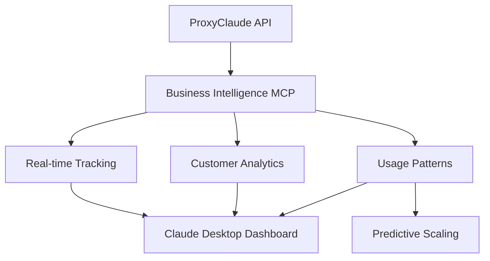
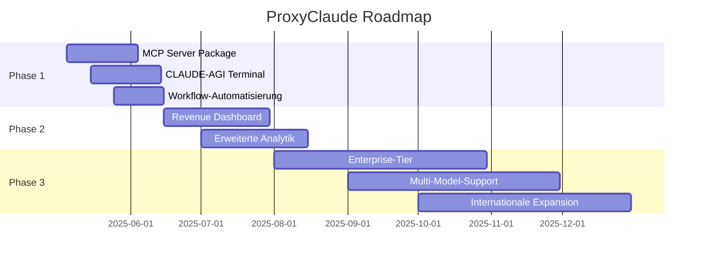

# 🚀 ProxyClaude Roadmap

## Überblick
Diese Roadmap definiert den Entwicklungsplan für die Integration und Erweiterung von ProxyClaude innerhalb des CLAUDE-AGI Ökosystems. Der Plan umfasst drei Hauptphasen mit klaren Meilensteinen und technischen Spezifikationen.

## Phase 1: Vollständige Integration (2-4 Wochen)

### 🔗 MCP Server Package Entwicklung

**Aufgabe**: Implementierung des `@proxyclaude/mcp-server` npm-Pakets  
**Ziel**: Nahtlose Integration von ProxyClaude als MCP-Tool in Claude Desktop

**Komponenten**:
```typescript
// packages/mcp-server/src/proxyclaude-mcp.ts
import { McpServer } from "@modelcontextprotocol/sdk/server/mcp.js";
import { z } from "zod";

// ProxyClaude-spezifische Tools
export const proxyClaudeTools = {
  // Team Builder API Integration
  createCustomTeam: z.object({
    members: z.array(z.string()),
    capabilities: z.array(z.string()),
    project: z.string()
  }),
  
  // Resource Management
  optimizeResourceAllocation: z.object({
    type: z.enum(['claude-pro-max', 'claude-unlimited']),
    priority: z.number(),
    task: z.string()
  }),
  
  // Business Analytics
  getBusinessMetrics: z.object({
    timeframe: z.string(),
    metrics: z.array(z.string())
  })
};

// NPM Package Structure
/*
@proxyclaude/mcp-server/
├── src/
│   ├── index.ts
│   ├── tools/
│   │   ├── team-builder.ts
│   │   ├── resource-manager.ts
│   │   └── analytics.ts
│   └── utils/
│       └── api-client.ts
├── package.json
└── README.md
*/
```

**NPM Package Deployment Plan:**
```bash
# Veröffentlichung
npm publish @proxyclaude/mcp-server

# Integration in Claude Desktop
{
  "mcpServers": {
    "proxyclaude": {
      "command": "npx",
      "args": ["-y", "@proxyclaude/mcp-server"]
    }
  }
}
```

**Meilensteine**:
- MCP Server Grundstruktur erstellen (1 Woche)
- API-Anbindung implementieren (1 Woche)
- Testing und Dokumentation (1 Woche)
- npm-Paket veröffentlichen (1 Tag)

### 🤖 CLAUDE-AGI Terminal Erweiterung

**Features**:
- **Smart Routing**: Automatische Auswahl zwischen ProxyClaude und direkter API
- **Token-Optimierung**: Intelligente Nutzung der "unlimited Credits" über ProxyClaude
- **Ressourcen-Management**: Priorisierung basierend auf Account-Tiers

**Implementierung**:
```typescript
// claude-agi/src/components/router.ts
export class SmartRouter {
  async routeRequest(prompt: string, context: AgentContext): Promise<Response> {
    // Analyse der Anfrage
    const complexity = await this.analyzeComplexity(prompt);
    const resourceAvailability = await this.checkResources();
    
    // Entscheidungslogik
    if (complexity > 0.7 && resourceAvailability.proxyClaudeCredits > 10000) {
      return this.useProxyClaude({
        model: 'claude-team',
        capabilities: ['extended-thinking', 'multimodal-analysis']
      });
    } else if (context.user.tier === 'PRO-MAX') {
      return this.useDirectAPI();
    } else {
      return this.optimizeForCredits(prompt);
    }
  }
}
```

**Integration in Claude Desktop:**
```javascript
// claude-agi/mcp-config.json
{
  "routingRules": {
    "default": "proxyclaude",
    "overrides": [
      {
        "condition": "userTier==='PRO-MAX' && taskPriority==='HIGH'",
        "route": "direct-api"
      }
    ]
  }
}
```

**Meilensteine**:
- Smart Router Design und Implementierung (1 Woche)
- UI-Anpassungen im Terminal (1 Woche)
- Benutzer-Präferenzen und Einstellungen (1 Woche)
- Integration Testing (1 Woche)

### 🔄 Workflow-Automatisierung

**Bereiche**:
- User-Onboarding Automation
- Error-Handling und Self-Healing
- Wartungsaufgaben und Updates

**Beispiel-Workflow**:
```javascript
// Automatisierter Onboarding-Workflow
async function onboardNewUser(userData) {
  // 1. Benutzer in System anlegen
  const user = await createUser(userData);
  
  // 2. API-Key generieren
  const apiKey = await generateApiKey(user.id);
  
  // 3. Invite-Link erstellen
  const inviteLink = await createInviteLink(user.id);
  
  // 4. Willkommens-Email senden
  await sendWelcomeEmail(user.email, {inviteLink, apiKey});
  
  // 5. Benutzerstatistik initialisieren
  await initUserStats(user.id);
  
  // 6. Memory-Bank-Eintrag erstellen
  await updateMemoryBank('users', user.id, userData);
  
  return {user, apiKey, inviteLink};
}
```

**Meilensteine**:
- Workflow-Engine Design (1 Woche)
- Core Workflows implementieren (1 Woche)
- Testing und Optimierung (1 Woche)

## Phase 2: Business Intelligence Integration (1-2 Monate)

### 💰 Revenue Dashboard

**Architektur**:


**Implementierung**:
```typescript
// revenue-dashboard/components/dashboard.tsx
import { useProxyClaudeAPI } from '@proxyclaude/react-hooks';

interface RevenueMetrics {
  mrr: number;
  arr: number;
  churnRate: number;
  clv: number;
  tierDistribution: {
    basic: number;
    pro: number;
    enterprise: number;
  };
}

export const RevenueDashboard = () => {
  const { data: metrics } = useProxyClaudeAPI<RevenueMetrics>({
    endpoint: '/analytics/revenue',
    refreshInterval: 60000 // Real-time updates
  });

  return (
    <div className="dashboard">
      <RevenueCharts data={metrics} />
      <PredictiveAnalytics />
      <CustomGrowIntegration /> {/* CustomGrow.club synergy */}
    </div>
  );
};
```

**KI-gestütztes Forecasting:**
```typescript
// forecast-engine/index.ts
export class RevenueForecaster {
  async predictGrowth(historicalData: RevenueMetrics[]): Promise<Forecast> {
    const prompt = `
    Analysiere diese Geschäftsdaten von ProxyClaude:
    - Aktueller MRR: ${metrics.mrr}
    - Customer Growth Rate: ${metrics.growthRate}
    - Enterprise Pipeline: ${metrics.enterprise}
    
    Berücksichtige die CustomGrow.club Integration und das DeepSleep FEBA Produkt.
    `;
    
    return await claude.generateForecast(prompt, {
      useExtendedThinking: true,
      includeRiskAssessment: true
    });
  }
}
```

**Komponenten**:
- **Real-time Tracking**: Echtzeitdaten zu API-Nutzung und Einnahmen
- **Customer Analytics**: Benutzerverhalten und Nutzungsmuster
- **Usage Patterns**: Analyse der Nutzungsspitzen und Optimierungspotential
- **Predictive Scaling**: Vorhersage von Ressourcenbedarf

**Meilensteine**:
- Datensammlung und Speicherung implementieren (2 Wochen)
- Dashboard-UI entwickeln (2 Wochen)
- BI-MCP-Tool erstellen (2 Wochen)
- Integration in Claude Desktop (1 Woche)

### 📊 Erweiterte Analytik

**Features**:
- **Customer Lifetime Value (CLV)**: Automatische Berechnung pro Tier
- **Churn Prediction**: ML-basierte Frühwarnungen
- **Resource-Forecasting**: Vorhersage der Claude Pro MAX Auslastung

**Implementierung ML-Modell**:
```python
# Churn Prediction Model
import tensorflow as tf

class ChurnPredictionModel:
    def __init__(self, config):
        self.config = config
        self.model = self._build_model()
        
    def _build_model(self):
        model = tf.keras.Sequential([
            tf.keras.layers.Dense(64, activation='relu', input_shape=(self.config.feature_count,)),
            tf.keras.layers.Dropout(0.2),
            tf.keras.layers.Dense(32, activation='relu'),
            tf.keras.layers.Dropout(0.2),
            tf.keras.layers.Dense(1, activation='sigmoid')
        ])
        
        model.compile(
            optimizer=tf.keras.optimizers.Adam(0.001),
            loss='binary_crossentropy',
            metrics=['accuracy', tf.keras.metrics.AUC()]
        )
        
        return model
    
    def train(self, X_train, y_train, epochs=20):
        return self.model.fit(
            X_train, y_train,
            epochs=epochs,
            validation_split=0.2,
            callbacks=[
                tf.keras.callbacks.EarlyStopping(patience=3, restore_best_weights=True)
            ]
        )
    
    def predict(self, user_data):
        return self.model.predict(user_data)
```

**Meilensteine**:
- Data Pipeline für ML-Modelle aufbauen (2 Wochen)
- ML-Modell Training und Evaluation (2 Wochen)
- Integration in BI-Dashboard (2 Wochen)
- Automatisierte Reporting-Workflows (1 Woche)

## Phase 3: Skalierung & Monetarisierung (3-6 Monate)

### 🏢 Enterprise-Tier (≥€100/Monat)

**Features**:
```typescript
// enterprise-features/advanced-integration.ts
interface EnterpriseFeatures {
  dedicatedAPI: {
    endpoint: string;
    rateLimits: 'unlimited';
    customDomains: string[];
  };
  
  prioritySupport: {
    directSlackChannel: boolean;
    dedicatedManagerEmail: string;
    24hrSLA: boolean;
  };
  
  customIntegrations: {
    whiteLabel: boolean;
    customEndpoints: boolean;
    apiWebhooks: boolean;
  };
  
  brandedEndpoints: {
    domain: string;
    customSubdomain: boolean;
    ssl: 'dedicated';
  };
}

// Business Synergy mit bestehendem Portfolio
export class EnterpriseOrchestrator {
  async integrateBusinesses() {
    // AClearAllB.gg NFT-Integration
    await this.connectSolanaChain();
    
    // CustomGrow.club Analytics
    await this.syncAnalyticsPlatform();
    
    // DeepSleep FBA Automation
    await this.setupAmazonFBAIntegration();
    
    // Goldankauf Digital Transformation
    await this.createDigitalWorkflows();
  }
}
```

**Slack-Integration:**
```typescript
interface SlackIntegration {
  channels: {
    alerts: '#api-alerts',
    support: '#priority-support'
  },
  automatedReporting: true,
  responseTime: '<1h'
}
```

**Implementierung Enterprise-Dashboard**:
```typescript
// Enterprise Dashboard
class EnterpriseDashboard extends Dashboard {
  constructor(config: EnterpriseConfig) {
    super(config);
    this.initEnterpriseFeatures();
  }
  
  private initEnterpriseFeatures() {
    // Enterprise-spezifische Features aktivieren
    this.addComponent(new TeamManagementPanel());
    this.addComponent(new ResourceAllocationPanel());
    this.addComponent(new CustomIntegrationsPanel());
    this.addComponent(new BrandingConfigPanel());
    this.addComponent(new AdvancedAnalyticsPanel());
    this.addComponent(new SupportTicketPanel());
    
    // Enterprise-API Konfiguration
    this.apiConfig = new EnterpriseAPIConfig({
      dedicatedEndpoint: true,
      rateLimits: {
        requestsPerMinute: 500,
        tokensPerDay: 1000000
      },
      priorities: {
        queuePriority: 0, // Höchste Priorität
        supportPriority: 'critical'
      }
    });
  }
}
```

**Meilensteine**:
- Enterprise Tier Design und Implementierung (1 Monat)
- Dedicated API Infrastructure (1 Monat)
- Custom Integration Framework (1 Monat)
- Enterprise Dashboard (1 Monat)
- Enterprise-Grade Security Features (1 Monat)

### 🌐 Multi-Model-Support

**Features**:
- Unterstützung für Claude 3 Opus, Sonnet und Haiku
- OpenAI GPT-4, GPT-3.5 Turbo Integration
- Anthropic Multimodal-API Unterstützung
- Modell-Routing basierend auf Anforderungen

**Modell-Dispatcher**:
```typescript
// Multi-Model Dispatcher
class ModelDispatcher {
  private models: Map<string, ModelConnector> = new Map();
  
  constructor() {
    // Modell-Connectoren registrieren
    this.registerModel('claude-3-opus', new ClaudeConnector('opus'));
    this.registerModel('claude-3-sonnet', new ClaudeConnector('sonnet'));
    this.registerModel('claude-3-haiku', new ClaudeConnector('haiku'));
    this.registerModel('gpt-4', new OpenAIConnector('gpt-4'));
    this.registerModel('gpt-3.5-turbo', new OpenAIConnector('gpt-3.5-turbo'));
  }
  
  registerModel(name: string, connector: ModelConnector) {
    this.models.set(name, connector);
  }
  
  async dispatch(request: ModelRequest): Promise<ModelResponse> {
    // Bestimme das optimale Modell basierend auf den Anforderungen
    const modelName = this.determineOptimalModel(request);
    const connector = this.models.get(modelName);
    
    if (!connector) {
      throw new Error(`Model ${modelName} not supported`);
    }
    
    // Führe die Anfrage gegen das ausgewählte Modell aus
    return connector.execute(request);
  }
  
  private determineOptimalModel(request: ModelRequest): string {
    // Logik zur Modellauswahl basierend auf:
    // - Explizite Angabe vom Benutzer
    // - Komplexität der Anfrage
    // - Kosten-/Leistungsverhältnis
    // - Multimodal-Anforderungen (Bilder, etc.)
    // - User-Präferenzen und Tier
  }
}
```

**Meilensteine**:
- Multi-Model-Dispatcher implementieren (1 Monat)
- Modell-spezifische Konnektoren entwickeln (1 Monat)
- Modell-Auswahl-Logik optimieren (1 Monat)
- UI-Anpassungen für Modellauswahl (2 Wochen)
- Performance Testing und Optimierung (1 Monat)

### 🌍 Internationale Expansion

**Features**:
- Mehrsprachiger Support (DE, EN, FR, ES, IT)
- Regionale API-Endpunkte
- Lokalisierte Zahlungsoptionen
- Internationales Marketing

**Lokalisierungs-Framework**:
```typescript
// i18n Framework
class I18nManager {
  private translations: Map<string, Record<string, string>> = new Map();
  private currentLocale: string = 'en';
  
  constructor(locales: string[]) {
    // Lade Übersetzungen für alle unterstützten Sprachen
    for (const locale of locales) {
      this.loadTranslations(locale);
    }
  }
  
  async loadTranslations(locale: string) {
    const translations = await fetchTranslations(locale);
    this.translations.set(locale, translations);
  }
  
  setLocale(locale: string) {
    if (!this.translations.has(locale)) {
      throw new Error(`Locale ${locale} not supported`);
    }
    
    this.currentLocale = locale;
  }
  
  translate(key: string, params: Record<string, string> = {}): string {
    const translations = this.translations.get(this.currentLocale);
    if (!translations || !translations[key]) {
      return key; // Fallback auf den Schlüssel selbst
    }
    
    let text = translations[key];
    
    // Parameter ersetzen
    for (const [param, value] of Object.entries(params)) {
      text = text.replace(`{${param}}`, value);
    }
    
    return text;
  }
}
```

**Meilensteine**:
- Lokalisierungs-Framework implementieren (1 Monat)
- Regionale API-Infrastruktur aufbauen (1 Monat)
- Internationale Zahlungsintegrationen (1 Monat)
- Lokalisiertes Marketing-Material (1 Monat)
- Support-Team für internationale Märkte (1 Monat)

## Gesamtzeitplan



## Prioritäten & Kritische Pfade

### Wichtigste Prioritäten
1. MCP Server Package (Phase 1) - Ermöglicht die grundlegende Integration
2. Revenue Dashboard (Phase 2) - Schafft Transparenz über die Geschäftsentwicklung
3. Enterprise-Tier (Phase 3) - Öffnet neue Einnahmequellen

### Kritische Pfade
- MCP Server Package → CLAUDE-AGI Terminal Erweiterung → Workflow-Automatisierung
- Revenue Dashboard → Erweiterte Analytik → Enterprise-Tier
- Enterprise-Tier → Multi-Model-Support → Internationale Expansion

### Abhängigkeiten
- Die Terminal-Erweiterung setzt das MCP Server Package voraus
- Das BI-Dashboard benötigt ausreichende Datenbasis aus Phase 1
- Enterprise-Features bauen auf dem stabilen Kern aus Phase 1 und 2 auf

## Ressourcenbedarf

### Entwicklung
- 1 Backend-Entwickler (Vollzeit)
- 1 Frontend-Entwickler (Teilzeit)
- 1 DevOps-Spezialist (Teilzeit)
- 1 Data Scientist (Phase 2, Teilzeit)

### Infrastruktur
- Development-Umgebung
- Staging-Umgebung
- Produktions-Infrastruktur (skalierbar)
- CI/CD-Pipeline

### Externe Dienste
- GitHub/GitLab für Versionskontrolle
- npm-Registry für Package-Distribution
- Stripe für Zahlungsabwicklung
- Claude API-Zugang (Pro MAX)
- Optional: OpenAI API-Zugang