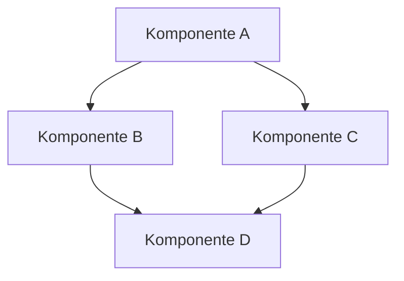
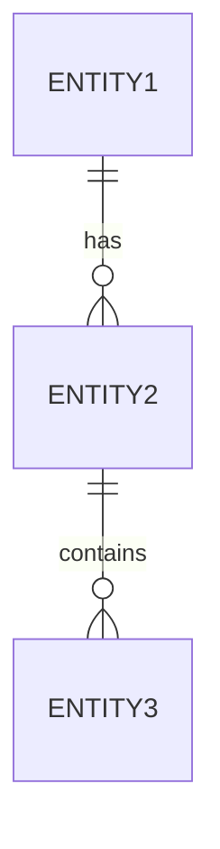

# [Projektname] - Systemmuster und Architekturen

## Systemarchitektur

### Hochebenenübersicht
[Beschreibung der allgemeinen Systemarchitektur. Dies kann ein Diagramm, eine textuelle Beschreibung oder beides sein.]

### Hauptkomponenten
- **[Komponente A]**: [Beschreibung der Verantwortlichkeiten und Funktionen]
- **[Komponente B]**: [Beschreibung der Verantwortlichkeiten und Funktionen]
- **[Komponente C]**: [Beschreibung der Verantwortlichkeiten und Funktionen]
- **[Komponente D]**: [Beschreibung der Verantwortlichkeiten und Funktionen]

### Datenfluss
[Beschreibung, wie Daten durch das System fließen. Wo kommen sie herein, wie werden sie verarbeitet, und wo gehen sie hinaus?]

## Design-Patterns

### Architekturmuster
- **[Muster 1]**: [Wo und wie wird es verwendet?]
- **[Muster 2]**: [Wo und wie wird es verwendet?]
- **[Muster 3]**: [Wo und wie wird es verwendet?]

### Entwurfsmuster
- **[Muster 1]**: [Wo und wie wird es verwendet?]
- **[Muster 2]**: [Wo und wie wird es verwendet?]
- **[Muster 3]**: [Wo und wie wird es verwendet?]

## Codeorganisation
- **Ordnerstruktur**: [Beschreibung der Hauptordner und ihrer Zwecke]
- **Namenskonventionen**: [Beschreibung der Namenskonventionen für Dateien, Klassen, Funktionen, etc.]
- **Modularisierung**: [Wie ist der Code in Module oder Pakete aufgeteilt?]

## Schnittstellen

### API-Design
[Beschreibung der API-Design-Prinzipien und -Entscheidungen]

### Externe Schnittstellen
- **[Schnittstelle 1]**: [Beschreibung]
- **[Schnittstelle 2]**: [Beschreibung]
- **[Schnittstelle 3]**: [Beschreibung]

### Interne Schnittstellen
- **[Schnittstelle 1]**: [Beschreibung]
- **[Schnittstelle 2]**: [Beschreibung]
- **[Schnittstelle 3]**: [Beschreibung]

## Datenmodell

### Entitäten
- **[Entität 1]**: [Beschreibung und Attribute]
- **[Entität 2]**: [Beschreibung und Attribute]
- **[Entität 3]**: [Beschreibung und Attribute]

### Beziehungen
[Beschreibung der Beziehungen zwischen den Entitäten]

## Technische Schulden
- **[Schuld 1]**: [Beschreibung, warum es eine Schuld ist und mögliche Lösungen]
- **[Schuld 2]**: [Beschreibung, warum es eine Schuld ist und mögliche Lösungen]
- **[Schuld 3]**: [Beschreibung, warum es eine Schuld ist und mögliche Lösungen]

## Sicherheitsüberlegungen
- **Authentifizierung**: [Beschreibung]
- **Autorisierung**: [Beschreibung]
- **Datenschutz**: [Beschreibung]
- **Sichere Kommunikation**: [Beschreibung]

## Performanzüberlegungen
- **Skalierbarkeit**: [Beschreibung]
- **Caching-Strategien**: [Beschreibung]
- **Leistungsengpässe**: [Beschreibung]
- **Optimierungstechniken**: [Beschreibung]

## Tags: architektur, design-patterns, systemdesign, [tag4], [tag5]