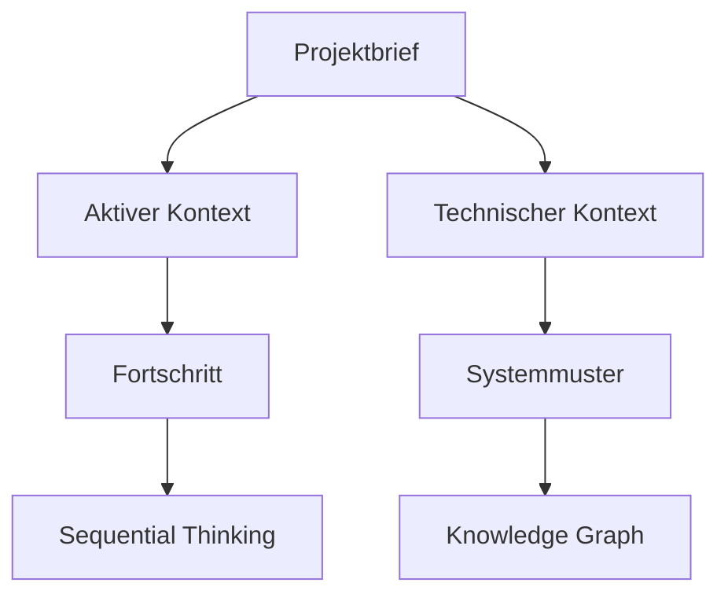

# Memory Bank - Claude-AGI Persistence System v2.0

Die Memory Bank ist ein strukturiertes Dateisystem für die Speicherung von Projekt-Kontext und Wissen in Claude-AGI-Projekten. Sie ermöglicht die Kontinuität zwischen Sitzungen und dient als zentrale Wissensquelle für alle Claude-AGI-Anwendungen.


## Struktur

Jedes Projekt enthält einen `memory-bank`-Ordner mit den folgenden Kerndateien:

| Datei | Beschreibung |
|-------|-------------|
| `projectbrief.md` | Grundlegende Projektdefinition, Ziele und Umfang |
| `productContext.md` | Zweck und Problemlösung des Projekts |
| `activeContext.md` | Aktueller Arbeitsfokus und Prioritäten |
| `systemPatterns.md` | Systemarchitektur und Design-Patterns |
| `techContext.md` | Verwendete Technologien und technische Entscheidungen |
| `progress.md` | Aktueller Status und Fortschrittsprotokoll |
| `sequentialThinking.config` | Konfiguration für strukturiertes Reasoning |
| `knowledgeGraph.json` | Semantisches Netzwerk von Projektkonzepten |

## API-Komponenten

Die Memory Bank v2.0 beinhaltet fortschrittliche APIs für erweiterte Funktionalität:

| API | Beschreibung |
|-----|-------------|
| `knowledgeGraphAPI.js` | API für Erstellung und Abfrage semantischer Wissensnetze |
| `sequentialThinkingAPI.js` | API für strukturiertes, schrittweises Problemlösen |

## Verwendung

### Neue Memory Bank erstellen

```bash
# Erstellt eine neue Memory Bank mit Standarddateien
mkdir -p project-name/memory-bank
cp -r /home/jan/Schreibtisch/CLAUDE/memory-bank/templates/* project-name/memory-bank/
```

### Memory Bank aktualisieren

```bash
# Kontext aktualisieren
claude-agi update-memory /pfad/zum/projekt
```

### Knowledge Graph API verwenden

```javascript
const KnowledgeGraphAPI = require('./memory-bank/apis/knowledgeGraphAPI');

// Initialisieren
const graph = new KnowledgeGraphAPI('/pfad/zum/projekt');

// Konzepte hinzufügen
const nodeId1 = graph.addConcept('React', 'technology', { version: '18.2.0' });
const nodeId2 = graph.addConcept('Next.js', 'technology', { version: '13.0.0' });

// Beziehungen erstellen
graph.addRelationship(nodeId1, nodeId2, 'uses');

// Konzepte aus Text extrahieren
const mdContent = fs.readFileSync('/pfad/zum/projekt/README.md', 'utf8');
const extractedConcepts = graph.extractConceptsFromText(mdContent, 'feature');

// Automatisches Update aus Memory Bank
const updateSummary = graph.updateFromMemoryBank();
console.log(`Added ${updateSummary.conceptsAdded} new concepts`);

// Visualisierung erstellen
const htmlViz = graph.visualize('html');
fs.writeFileSync('knowledge-graph.html', htmlViz);
```

### Sequential Thinking API verwenden

```javascript
const SequentialThinkingAPI = require('./memory-bank/apis/sequentialThinkingAPI');

// Initialisieren
const thinking = new SequentialThinkingAPI('/pfad/zum/projekt');

// Konfiguration anpassen
thinking.updateConfig({
  maxSteps: 7,
  appendToActiveContext: true
});

// Strukturiertes Denken zu einem Problem
const problem = 'Wie kann die Performance der Anwendung verbessert werden?';
const session = await thinking.think(problem, { steps: 5 });

console.log(`Conclusion: ${session.conclusion}`);

// Frühere Denksitzungen abrufen
const performanceHistory = thinking.getHistory('Performance');
```

## Memory Bank im Claude-AGI-Ökosystem

Die Memory Bank v2.0 ist eng mit allen Komponenten des Claude-AGI-Ökosystems integriert:

- **Claude Terminal**: Visualisierung und Bearbeitung der Memory Bank
- **Claude Desktop**: Direkter Zugriff über Memory Bank MCP-Tool
- **ProxyClaude**: Gemeinsamer Zugriff für Teams
- **Vibe-Coding-Projekte**: Automatische Integration in neue Projekte

## Erweiterte Funktionen v2.0

### Knowledge Graph System

Das Knowledge Graph System ermöglicht die Erstellung semantischer Netzwerke von Projektkonzepten:

- **Automatische Konzeptextraktion**: Identifiziert wichtige Konzepte aus Projektdokumentation
- **Beziehungsmodellierung**: Erstellt semantische Verbindungen zwischen Konzepten
- **Visualisierung**: Graphische Darstellung des Projektwissens
- **Abfrage-Engine**: Ermöglicht komplexe Abfragen über Projektwissen
- **Pfadsuche**: Findet Verbindungen zwischen verschiedenen Konzepten

### Sequential Thinking Framework

Das Sequential Thinking Framework unterstützt strukturiertes Problemlösen:

- **Schrittweise Analyse**: Zerlegt komplexe Probleme in logische Schritte
- **Gedächtnispersistenz**: Speichert Denkprozesse für späteren Zugriff
- **MCP-Integration**: Verbindet mit dem Sequential Thinking MCP-Server
- **Aktive Kontextintegration**: Fügt Erkenntnisse automatisch in den aktiven Kontext ein
- **Historische Analyse**: Ermöglicht die Überprüfung früherer Denkprozesse

### Kontextmanagementsystem

Verbessertes Kontextmanagementsystem:

- **Automatische Aktualisierung**: Bei Git-Commits oder Projektänderungen
- **Kontextwechsel**: Einfacher Wechsel zwischen verschiedenen Projektaspekten
- **Intelligente Querverweis**: Verknüpft zusammenhängende Informationen
- **Versionierung**: Behält historische Kontextversionen bei

## Best Practices

1. **Aktiver Kontext**: Halte `activeContext.md` aktuell für optimale Claude-Unterstützung
2. **System-Dokumentation**: Dokumentiere Architekturentscheidungen in `systemPatterns.md`
3. **Fortschrittsverfolgung**: Aktualisiere `progress.md` nach jeder Arbeitssitzung
4. **Semantische Struktur**: Verwende Markdown-Überschriften konsistent (# für Hauptthemen)
5. **Wissensvernetzung**: Nutze das Knowledge Graph API für komplexe Projekte
6. **Problemlösung**: Verwende Sequential Thinking für schwierige Herausforderungen
7. **Mermaid-Diagramme**: Visualisiere Beziehungen mit eingebetteten Diagrammen:



## Integration mit MCP-Tools

Die Memory Bank v2.0 bietet verbesserte MCP-Integration:

```json
{
  "mcpServers": {
    "memory-bank": {
      "command": "npx",
      "args": ["-y", "@claude-agi/memory-bank-mcp@latest"],
      "env": {
        "MEMORY_BANK_ROOT": "/home/jan/Schreibtisch/CLAUDE/memory-bank",
        "ENABLE_KNOWLEDGE_GRAPH": "true",
        "ENABLE_SEQUENTIAL_THINKING": "true"
      }
    }
  }
}
```

## CLI-Integration

Die Memory Bank v2.0 kann direkt über das Terminal aktualisiert werden:

```bash
# Aktualisiere Memory Bank für ein Projekt
claude-agi memory-bank update /pfad/zum/projekt

# Extrahiere Wissen in Knowledge Graph
claude-agi memory-bank extract-knowledge /pfad/zum/projekt

# Wende Sequential Thinking auf ein Problem an
claude-agi memory-bank think "Wie verbessere ich die App-Performance?"

# Generiere Visualisierung des Knowledge Graphs
claude-agi memory-bank visualize-graph /pfad/zum/projekt --format html --output graph.html
```

## Beispielprojekte

Die Memory Bank v2.0 wird in folgenden Beispielprojekten demonstriert:

- `/claude-terminal/memory-bank/` - Terminal-Anwendung mit Knowledge Graph
- `/claude-agi-project/memory-bank/` - Hauptprojekt mit vollständiger Integration
- `/VibeCodingTest/memory-bank/` - Vibe-Coding-Projekt mit Sequential Thinking

## Zukunftserweiterungen

Geplante Erweiterungen für Memory Bank v2.1:

- **Echtzeit-Kollaboration**: Synchronisierung zwischen mehreren Nutzern
- **KI-gestützte Zusammenfassung**: Automatische Zusammenfassung komplexer Projektinformationen
- **Erweiterte Visualisierung**: 3D-Visualisierung des Knowledge Graphs
- **Integration mit Git**: Automatische Aktualisierung bei Commits